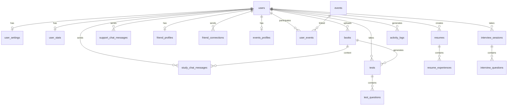

# Inknito — Backend

The app has 4 main sections: **Academic Success**, **Wellbeing & Motivation**, **Career & Future Readiness**, and **Profile**.

---

# Damien Database Layer (Drizzle)

General conventions:
 Every table gets `id` (uuid), `createdAt`, `updatedAt` unless noted otherwise
 Use foreign keys for all relationships
 Books, resumes use soft delete (`deletedAt` column)

## Tables

### `users`

| Column | Type | Notes |
|--------|------|-------|
| `id` | uuid, PK | |
| `studentId` | varchar(50), unique | e.g. `8767YUYF` |
| `name` | varchar(255) | |
| `email` | varchar(255), unique | |
| `password` | text | hashed |
| `university` | varchar(255) | |
| `major` | varchar(255) | |
| `graduationYear` | integer | |
| `avatarUrl` | text, nullable | stored file path or URL |
| `level` | integer, default 1 | gamification level, shown in profile |
| `createdAt` | timestamp | |
| `updatedAt` | timestamp | |

### `user_settings`

One-to-one with users. The frontend has toggles for these in the Profile > Settings tab.

| Column | Type | Notes |
|--------|------|-------|
| `id` | uuid, PK | |
| `userId` | uuid, FK → users | |
| `darkMode` | boolean, default true | |
| `emailNotifications` | boolean, default true | |
| `publicProfile` | boolean, default false | controls badge visibility to others |

### `books`

Users upload PDF/TXT/DOC/DOCX files. Currently stored in localStorage on the frontend which obviously won't scale.

| Column | Type | Notes |
|--------|------|-------|
| `id` | uuid, PK | |
| `userId` | uuid, FK → users | |
| `originalName` | varchar(500) | filename without extension |
| `customName` | varchar(500), nullable | user can rename via double-click |
| `fileUrl` | text | path in storage (S3, GCS, whatever we pick) |
| `fileType` | varchar(20) | pdf/txt/doc/docx |
| `pageCount` | integer | |
| `extractedText` | text, nullable | parsed content — needed for the AI study/test features |
| `createdAt` | timestamp | |
| `updatedAt` | timestamp | |
| `deletedAt` | timestamp, nullable | |

### `study_chat_messages`

Messages from the Study Mode chat. Each conversation is tied to a specific book.

| Column | Type | Notes |
|--------|------|-------|
| `id` | uuid, PK | |
| `userId` | uuid, FK → users | |
| `bookId` | uuid, FK → books | |
| `sender` | varchar(10) | `user` or `ai` |
| `text` | text | |
| `createdAt` | timestamp | |

### `tests`

Generated quizzes. The user picks question count (5/10/15/20), difficulty, and an optional focus topic.

| Column | Type | Notes |
|--------|------|-------|
| `id` | uuid, PK | |
| `userId` | uuid, FK → users | |
| `bookId` | uuid, FK → books | |
| `questionCount` | integer | |
| `difficulty` | varchar(20) | easy / medium / hard / mixed |
| `focusTopic` | varchar(500), nullable | |
| `score` | integer, nullable | filled after submission, percentage |
| `readiness` | varchar(100), nullable | Excellent / Good / Fair / Needs Improvement |
| `createdAt` | timestamp | |
| `completedAt` | timestamp, nullable | |

### `test_questions`

| Column | Type | Notes |
|--------|------|-------|
| `id` | uuid, PK | |
| `testId` | uuid, FK → tests | |
| `questionNumber` | integer | ordering |
| `questionText` | text | |
| `type` | varchar(20) | `multiple-choice` or `open-ended` |
| `options` | jsonb, nullable | array of strings, only for MC |
| `correctAnswer` | text, nullable | |
| `userAnswer` | text, nullable | |
| `isCorrect` | boolean, nullable | |
| `feedback` | text, nullable | per-question AI feedback |

### `support_chat_messages`

This is the anonymous mental health support chat. Important detail — the UI markets this as "100% Anonymous" with a lock badge, so we store `userId` for session continuity but !!!!!!!!never expose it in API responses!!!!!!!!

| Column | Type | Notes |
|--------|------|-------|
| `id` | uuid, PK | |
| `userId` | uuid, FK → users | internal only, not returned in API |
| `sender` | varchar(10) | `user` or `bot` |
| `text` | text | |
| `createdAt` | timestamp | |

### `friend_profiles`

Separate from the main user profile. Users fill this out when they enable the "Find Study Buddies" feature

| Column | Type | Notes |
|--------|------|-------|
| `id` | uuid, PK | |
| `userId` | uuid, FK → users | |
| `university` | varchar(255) | |
| `interests` | text | comma-separated |
| `goals` | text, nullable | |
| `isEnabled` | boolean, default false | toggle on/off |
| `createdAt` | timestamp | |
| `updatedAt` | timestamp | |

### `friend_connections`

| Column | Type | Notes |
|--------|------|-------|
| `id` | uuid, PK | |
| `fromUserId` | uuid, FK → users | requester |
| `toUserId` | uuid, FK → users | recipient |
| `status` | varchar(20) | pending / accepted / rejected |
| `createdAt` | timestamp | |
| `updatedAt` | timestamp | |

### `events_profiles`

Another profile form — this one is in the Career section, used to personalize event recommendations.

| Column | Type | Notes |
|--------|------|-------|
| `id` | uuid, PK | |
| `userId` | uuid, FK → users | |
| `specialization` | varchar(255) | |
| `experienceLevel` | varchar(20) | beginner / intermediate / advanced |
| `interests` | text | comma-separated |
| `createdAt` | timestamp | |
| `updatedAt` | timestamp | |

### `events`

| Column | Type | Notes |
|--------|------|-------|
| `id` | uuid, PK | |
| `name` | varchar(500) | |
| `organizer` | varchar(255) | |
| `type` | varchar(50) | Career Fair / Workshop / Competition / Conference |
| `date` | date | |
| `location` | varchar(255) | |
| `description` | text | |
| `isActive` | boolean, default true | |
| `createdAt` | timestamp | |

### `user_events`

Join table — tracks which events a user attended or saved.

| Column | Type | Notes |
|--------|------|-------|
| `id` | uuid, PK | |
| `userId` | uuid, FK → users | |
| `eventId` | uuid, FK → events | |
| `status` | varchar(20) | `attended` or `interested` |
| `matchScore` | integer, nullable | calculated match percentage |
| `createdAt` | timestamp | |

### `resumes`

| Column | Type | Notes |
|--------|------|-------|
| `id` | uuid, PK | |
| `userId` | uuid, FK → users | |
| `name` | varchar(255) | name as shown on resume |
| `email` | varchar(255) | |
| `phone` | varchar(50) | |
| `linkedin` | text, nullable | |
| `summary` | text, nullable | professional summary text |
| `skills` | jsonb | string array |
| `createdAt` | timestamp | |
| `updatedAt` | timestamp | |
| `deletedAt` | timestamp, nullable | |

### `resume_experiences`

| Column | Type | Notes |
|--------|------|-------|
| `id` | uuid, PK | |
| `resumeId` | uuid, FK → resumes | |
| `title` | varchar(255) | job title |
| `company` | varchar(255) | |
| `duration` | varchar(100) | free text, e.g. "Jan 2020 - Present" |
| `description` | text | |
| `sortOrder` | integer | display ordering |

### `interview_sessions`

| Column | Type | Notes |
|--------|------|-------|
| `id` | uuid, PK | |
| `userId` | uuid, FK → users | |
| `role` | varchar(255) | target position |
| `level` | varchar(20) | entry / mid / senior |
| `company` | varchar(255), nullable | |
| `overallScore` | integer, nullable | 0-100 |
| `communicationScore` | integer, nullable | 0-10 |
| `technicalScore` | integer, nullable | 0-10 |
| `confidenceScore` | integer, nullable | 0-10 |
| `createdAt` | timestamp | |
| `completedAt` | timestamp, nullable | |

### `interview_questions`

| Column | Type | Notes |
|--------|------|-------|
| `id` | uuid, PK | |
| `sessionId` | uuid, FK → interview_sessions | |
| `questionNumber` | integer | |
| `questionText` | text | |
| `userAnswer` | text, nullable | |
| `feedback` | text, nullable | |

### `user_stats`

Aggregated stats shown in the Profile > Statistics tab. Could be computed from other tables, but caching them here makes the profile load faster.

| Column | Type | Notes |
|--------|------|-------|
| `id` | uuid, PK | |
| `userId` | uuid, FK → users | |
| `studyHours` | decimal | |
| `averageGrade` | decimal | percentage |
| `eventsAttended` | integer | |
| `currentStreak` | integer | consecutive days |
| `updatedAt` | timestamp | |

### `activity_logs`

Powers the weekly activity bar chart on the profile page.

| Column | Type | Notes |
|--------|------|-------|
| `id` | uuid, PK | |
| `userId` | uuid, FK → users | |
| `date` | date | |
| `minutesActive` | integer | |

## Relationships



---

# Hideki API & Services

Conventions:
 REST endpoints, auth required on everything except `/api/auth/*`
 Standard response shape: `{ success: boolean, data?: T, error?: string }`
 Pagination where applicable: `?page=1&limit=20`

---

## Module 1: Auth

**`POST /api/auth/register`** — Create account

```json
{
  "studentId": "8767YUYF",
  "name": "Kassymkhanov Karim",
  "email": "8767YUYF@psba.edu.sg",
  "password": "...",
  "university": "PSB Academy",
  "major": "InfoComm Technology",
  "graduationYear": 2026
}
```

**`POST /api/auth/login`** — Returns JWT or session token

**`POST /api/auth/logout`** — Invalidates token

**`GET /api/auth/me`** — Returns current user from token

---

## Module 2: Profile

**`GET /api/profile`** — Full profile (user data + settings + stats)

**`PUT /api/profile`** — Update personal info

```json
{
  "name": "...",
  "email": "...",
  "university": "...",
  "major": "...",
  "graduationYear": 2026
}
```

**`PUT /api/profile/settings`** — Update toggles

```json
{
  "darkMode": true,
  "emailNotifications": true,
  "publicProfile": false
}
```

**`POST /api/profile/avatar`** — Upload avatar image (multipart/form-data)

**`GET /api/profile/stats`** — Returns `user_stats` plus last 7 days of `activity_logs` for the bar chart

---

## Module 3: Book Library

**`GET /api/books`** — List all books for current user

**`POST /api/books/upload`** — Upload a book file (multipart/form-data)

What this needs to do:
1. Accept PDF, TXT, DOC, or DOCX
2. Store the file (S3/GCS/local — your call)
3. Count pages
4. Extract the full text content (this is what the AI features use)
5. Save record to DB

**`PUT /api/books/:id`** — Rename a book

```json
{ "customName": "New name" }
```

**`DELETE /api/books/:id`** — Soft delete

---

## Module 4: Study Mode (AI Book Chat)

**`GET /api/books/:bookId/chat`** — Chat history for a specific book

**`POST /api/books/:bookId/chat`** — Send a question to the AI tutor

```json
{ "message": "Summarize this book" }
```

How it works:
1. Save the user message
2. Pull `extractedText` from the book record
3. Hit the LLM with the book text as context and the user's question
4. System prompt along the lines of: *"You are an AI tutor. Answer questions based strictly on the provided book content. Be accurate and helpful."*
5. Save the AI response
6. Return it

The frontend has quick-start buttons that just send these as regular messages:
- `Summarize "[book name]"`
- `Explain the main concepts`
- `Give me key takeaways`
- `Quiz me on this material`

---

## Module 5: Testing Mode (AI Quiz Generation)

**`POST /api/books/:bookId/tests/generate`**

```json
{
  "questionCount": 10,
  "difficulty": "medium",
  "topic": "Chapter 3"
}
```

Flow:
1. Get book text
2. Send to LLM — ask it to generate N questions at the given difficulty. If topic is provided, focus on that. Output format should be JSON with `question`, `type` (multiple-choice or open-ended), `options` (for MC), `correctAnswer`.
3. Store everything in `tests` + `test_questions`
4. Return the test to the client

**`PUT /api/tests/:testId/answer`** — Save answer for a question.

```json
{
  "questionId": "...",
  "answer": "Option B - ..."
}
```

**`POST /api/tests/:testId/submit`** — Finish test, get results.

Flow:
1. Gather all answers
2. For MC questions: compare directly with `correctAnswer`
3. For open-ended: send to LLM to evaluate
4. Calculate score percentage and readiness level
5. Generate per-question feedback via LLM
6. Update everything in DB

Response:
```json
{
  "score": 85,
  "correct": 8,
  "total": 10,
  "readiness": "Good - Almost Ready",
  "details": [
    { "questionNumber": 1, "correct": true, "feedback": "..." }
  ]
}
```

---

## Module 6: Anonymous Support Chat

> **Important:** This chat is branded as "100% Anonymous" in the UI. Don't leak any identifying info in responses.

**`GET /api/support/chat`** — Chat history (identified by auth token internally, but no user info in response).

**`POST /api/support/chat`**

```json
{ "message": "I need help with academic stress" }
```

Flow:
1. Save message
2. Send to LLM. System prompt should be something like: *"You are a supportive mental health chatbot for students. Be empathetic, non-judgmental. Offer practical coping strategies. If someone seems to be in crisis, recommend professional help. Never diagnose."*
3. Save and return the response

The frontend has topic chips that send pre-filled messages: Academic Stress, Anxiety, Relationships, Work-Life Balance, Motivation, General Support.

---

## Module 7: Friend Finder

**`GET /api/friends/profile`** — Get current user's friend finder profile.

**`PUT /api/friends/profile`**

```json
{
  "university": "MIT",
  "interests": "Computer Science, AI, Gaming",
  "goals": "Improve in machine learning",
  "isEnabled": true
}
```

**`GET /api/friends/discover`** — Find potential matches.

Query params: `?search=query`

Logic:
1. Get users where `friend_profiles.isEnabled = true`, exclude current user
2. If `search` param exists, filter by university name or interests
3. Exclude anyone the user already has a connection with

Returns:
```json
[
  {
    "id": "...",
    "name": "Alex M.",
    "avatar": "👨‍💻",
    "university": "MIT",
    "interests": ["Computer Science", "AI", "Gaming"]
  }
]
```

**`POST /api/friends/connect/:userId`** — Send connection request.

**`GET /api/friends/connections`** — All connections (pending + accepted).

**`PUT /api/friends/connections/:connectionId`** — Accept or reject.

```json
{ "status": "accepted" }
```

---

## Module 8: Professional Events

**`GET /api/events/profile`** — Get the user's events profile.

**`PUT /api/events/profile`**

```json
{
  "specialization": "Computer Science",
  "experienceLevel": "intermediate",
  "interests": "Web Development, Data Science"
}
```

**`GET /api/events/recommended`** — Get events with match scores.

Logic:
1. Load user's events profile
2. Fetch active events
3. Calculate match percentage per event (compare user specialization/interests against event type/description — can use LLM or simpler keyword matching)
4. Sort by match score descending

Returns:
```json
[
  {
    "id": "...",
    "name": "Tech Career Fair 2026",
    "organizer": "Tech Companies Alliance",
    "type": "Career Fair",
    "date": "2026-03-15",
    "location": "Online",
    "description": "...",
    "match": 95
  }
]
```

**`POST /api/events/:eventId/attend`** — Mark as attended

**`POST /api/events/:eventId/save`** — Save to interested list

**`GET /api/events/history`** — Past attended events

---

## Module 9: Resume Builder

**`GET /api/resumes`** — All resumes for current user

**`GET /api/resumes/:id`** — Single resume with experiences

**`POST /api/resumes`** — Create new resume

**`PUT /api/resumes/:id`** — Update resume

```json
{
  "name": "Alex Morgan",
  "email": "alex@example.com",
  "phone": "+1 234 567 8900",
  "linkedin": "linkedin.com/in/alexmorgan",
  "summary": "...",
  "skills": ["JavaScript", "React", "Node.js"],
  "experience": [
    {
      "title": "Senior Developer",
      "company": "Tech Corp",
      "duration": "Jan 2020 - Present",
      "description": "..."
    }
  ]
}
```

**`POST /api/resumes/:id/analyze`** — Run AI analysis on the resume

Send resume data to LLM, ask for a JSON response with `score` (0-100), `strengths` (string array), `improvements` (string array), `recommendations` (string array).

**`POST /api/resumes/:id/ai-suggestion`** — Get AI copy for a specific field

```json
{ "field": "summary" }
```

**`GET /api/resumes/:id/download`** — Generate and return a PDF. Use puppeteer, PDFKit, or html-pdf — whatever works best. The frontend already has a preview template that can serve as the layout reference.

---

## Module 10: Interview Practice

**`POST /api/interviews/start`**

```json
{
  "role": "Software Engineer",
  "level": "entry",
  "company": "Tech Startup"
}
```

Flow:
1. Create session record
2. Use LLM to generate 5 interview questions tailored to the role, level, and company. Mix of behavioral and technical.
3. Save questions, return session + first question

**`POST /api/interviews/:sessionId/answer`**

```json
{
  "questionId": "...",
  "answer": "..."
}
```

Send the answer to LLM for feedback, save it, return feedback + next question.

**`POST /api/interviews/:sessionId/finish`** — End the session.

Use LLM to compute final scores from all Q&A pairs: `overallScore` (0-100), `communication` (0-10), `technical` (0-10), `confidence` (0-10). Update session record.

**`GET /api/interviews/history`** — Past sessions with scores.

---

## All Endpoints (Quick Reference)

| # | Method | Path | Area |
|---|--------|------|------|
| 1 | POST | `/api/auth/register` | Auth |
| 2 | POST | `/api/auth/login` | Auth |
| 3 | POST | `/api/auth/logout` | Auth |
| 4 | GET | `/api/auth/me` | Auth |
| 5 | GET | `/api/profile` | Profile |
| 6 | PUT | `/api/profile` | Profile |
| 7 | PUT | `/api/profile/settings` | Profile |
| 8 | POST | `/api/profile/avatar` | Profile |
| 9 | GET | `/api/profile/stats` | Profile |
| 10 | GET | `/api/books` | Books |
| 11 | POST | `/api/books/upload` | Books |
| 12 | PUT | `/api/books/:id` | Books |
| 13 | DELETE | `/api/books/:id` | Books |
| 14 | GET | `/api/books/:bookId/chat` | Study |
| 15 | POST | `/api/books/:bookId/chat` | Study |
| 16 | POST | `/api/books/:bookId/tests/generate` | Testing |
| 17 | PUT | `/api/tests/:testId/answer` | Testing |
| 18 | POST | `/api/tests/:testId/submit` | Testing |
| 19 | GET | `/api/support/chat` | Support |
| 20 | POST | `/api/support/chat` | Support |
| 21 | GET | `/api/friends/profile` | Friends |
| 22 | PUT | `/api/friends/profile` | Friends |
| 23 | GET | `/api/friends/discover` | Friends |
| 24 | POST | `/api/friends/connect/:userId` | Friends |
| 25 | GET | `/api/friends/connections` | Friends |
| 26 | PUT | `/api/friends/connections/:id` | Friends |
| 27 | GET | `/api/events/profile` | Events |
| 28 | PUT | `/api/events/profile` | Events |
| 29 | GET | `/api/events/recommended` | Events |
| 30 | POST | `/api/events/:eventId/attend` | Events |
| 31 | POST | `/api/events/:eventId/save` | Events |
| 32 | GET | `/api/events/history` | Events |
| 33 | GET | `/api/resumes` | Resume |
| 34 | GET | `/api/resumes/:id` | Resume |
| 35 | POST | `/api/resumes` | Resume |
| 36 | PUT | `/api/resumes/:id` | Resume |
| 37 | POST | `/api/resumes/:id/analyze` | Resume |
| 38 | POST | `/api/resumes/:id/ai-suggestion` | Resume |
| 39 | GET | `/api/resumes/:id/download` | Resume |
| 40 | POST | `/api/interviews/start` | Interview |
| 41 | POST | `/api/interviews/:id/answer` | Interview |
| 42 | POST | `/api/interviews/:id/finish` | Interview |
| 43 | GET | `/api/interviews/history` | Interview |

---

## AI / LLM Integration Summary

These are the places where we need LLM calls. Pick OpenAI, Gemini, or whatever fits — just make sure the prompts are solid.

| Feature | What it does | Input | Output |
|---------|-------------|-------|--------|
| Study Chat | Answers questions about a book | book text + user question | text response |
| Test Generation | Creates quiz questions from book content | book text + count/difficulty/topic | JSON array of questions |
| Test Evaluation | Grades open-ended answers | question + user answer + correct answer | correct/incorrect + feedback |
| Support Chat | Mental health support responses | user message | text response |
| Events Matching | Calculates profile-event relevance | user profile + event data | percentage 0-100 |
| Resume Analysis | Scores and critiques a resume | resume data | score + strengths + improvements |
| Resume Suggestion | Writes professional copy | existing resume fields | suggested text |
| Interview Q Generation | Creates tailored interview questions | role + level + company | JSON array of questions |
| Interview Feedback | Evaluates interview answers | question + answer + context | feedback + sub-scores |
| Resume PDF | Generates downloadable PDF | resume data | PDF file |
